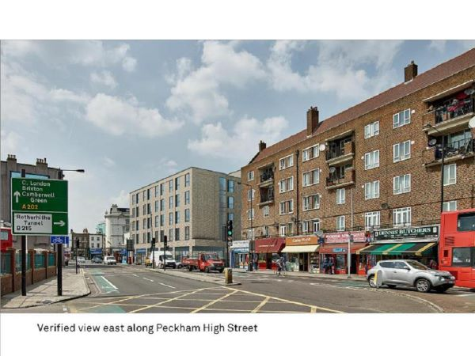

A five-story, 56-bed hotel to be built in the center of Peckham. The work involves the demolition of the existing two-story, low-rise block where the Peckham High Street Post Office and another two businesses are located, and the construction of the proposed block from the foundation.

